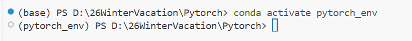
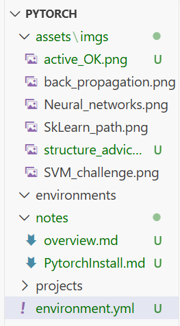
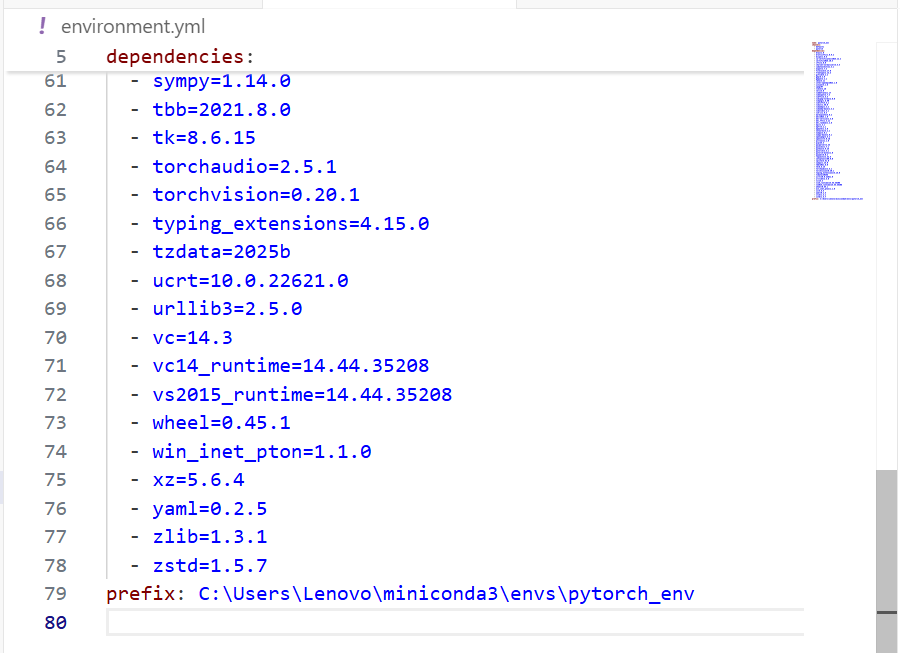
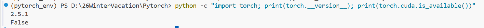
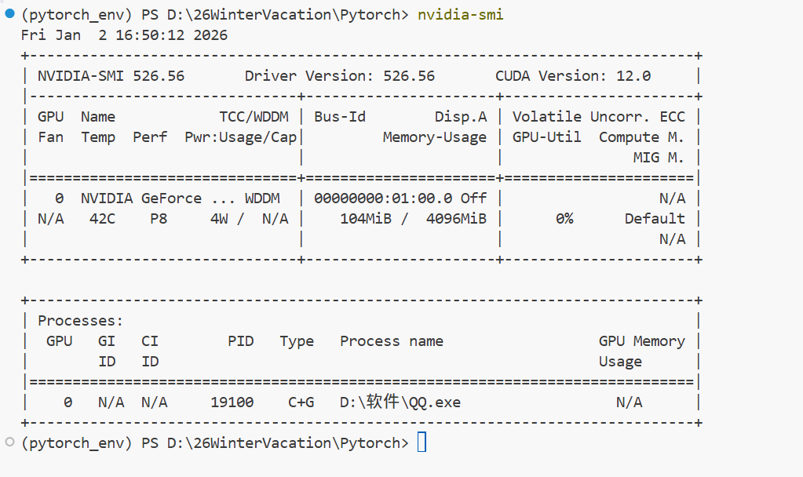
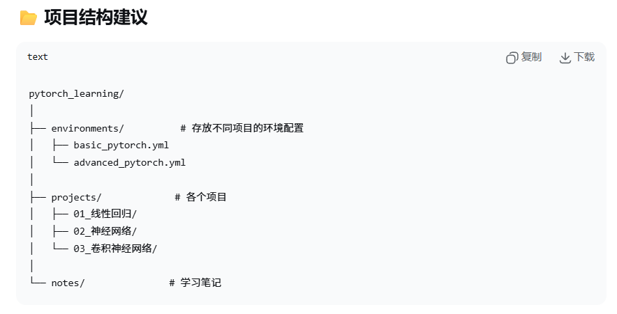

## 使用虚拟环境来管理PyTorch深度学习项目
#### 使用conda创建环境
1. 创建环境（指定Python版本）
   
    ```bash
    conda create -n pytorch_env python=3.9
    #-n (name)： 在全局 envs 目录下按名字创建环境。

    #把环境放在项目下的 env 文件夹
    conda create -p ./env 
    #-p (prefix)： 在指定路径创建环境（精确位置由你指定）。
    ```

    >proceed  v.继续

2. 激活环境
    ```bash
    conda activate pytorch_env
    ```
    激活成功截图
    
3. 安装PyTorch（以CUDA 11.3为例）
    ```bash
    conda install pytorch torchvision torchaudio cudatoolkit=11.3 -c pytorch
    #-c 是 --channel 的简写，用来指定 conda 从哪个渠道（channel）下载包。
    ```
    * pytorch：必须——PyTorch 框架本身。
    * torchvision：可选——常用的图像数据集、模型、变换（做视觉任务建议装）。
    * torchaudio：可选——音频处理/模型需要时装。
    * cudatoolkit=11.3：仅在你有 NVIDIA GPU 并要用 GPU 加速时需要；这是 conda 提供的 CUDA 运行时库，系统还需装相应的 NVIDIA 驱动。无 GPU 时可装 CPU-only。

    **CUDA 是什么？**

    CUDA（Compute Unified Device Architecture）是 NVIDIA 提供的并行计算平台与编程模型，允许把通用计算任务（GPGPU）交给 NVIDIA GPU 加速。

    与 PyTorch 的关系：PyTorch 的 GPU 加速依赖 CUDA。PyTorch 二进制会针对某个 CUDA 版本构建（例如 CUDA 11.8）；通过 conda 安装时常会一并安装

    **依赖记录到项目**

    environment.yml（conda）或 requirements.txt（pip），方便重现和分享。
    ```bash
    conda env export --no-builds -n pytorch_env > environment.yml
    ```
    * --no-builds 去掉平台相关的 build 字符串，提升可移植性。
    * 导出后打开 environment.yml，删除最后一行以 prefix: 开头的那一行（否则会写死本地路径）
  
        导出依赖后项目目录变化
        

        prefix行
        

4. 验证安装
    ```bash
    python -c "import torch; print(torch.__version__); print(torch.cuda.is_available())"
    #-c 是 Python 命令行的选项，意思是直接执行后面给出的字符串代码（不需要新建 .py 文件）。
    ```
    
    
    代码输出结果
    
    PyTorch 安装成功了（版本 2.5.1）。torch.cuda.is_available() = False 只说明 CUDA 不可用

    以下原因：
    1. 系统没有 NVIDIA GPU（最常见）
    2. 有 GPU 但驱动没装或版本不匹配（CUDA Toolkit 版本与驱动不兼容）
    3. 装的是 CPU-only 版本（虽然你用了 cudatoolkit=11.3，但某些情况下可能装错了）

    重点说明：

    * 即便 CUDA 不可用，PyTorch 仍可用（CPU 版本），学习时完全够用，只是计算速度慢。
    * 如果要启用 GPU，需要系统有 NVIDIA 显卡 + 官方驱动，且驱动版本支持对应 CUDA 版本。

    快速诊断：
    ```bash
    # 查看系统是否有 NVIDIA GPU 及驱动
    nvidia-smi
    ```  
    输出信息
    
    说明硬件和驱动都装了，但 PyTorch 与 CUDA 可能版本不匹配。(若报错"找不到命令"或"NVIDIA 驱动程序失败"，说明没装驱动或没有 GPU。)

    输出中找到 "CUDA Version: X.X"（这是驱动支持的最高 CUDA 版本），例如 12.1。

    ```bash
    # 清理 conda 缓存
    conda clean --all --yes
    # 使用 cudatoolkit 11.8（通常与新驱动兼容）
    conda install pytorch torchvision torchaudio cudatoolkit=11.8 -c pytorch -c nvidia -y
    #-y 表示“自动回答 yes”，用来跳过交互确认，直接接受所有提示
    ```
    频道顺序：

    -c pytorch -c nvidia 告诉 conda 先在 pytorch 查找，再在 nvidia，最后用 defaults 等默认源（conda 按给定顺序匹配包）。

    通常来源：
    * pytorch、torchvision、torchaudio：通常来自 pytorch channel。
    * pytorch-cuda=12.1：通常来自 nvidia channel（也可能在其它 channel 有镜像，取决于可用性）。
  
    结果
    
### 项目结构建议
