## PyTorch 目标检测实战系列教程-入门篇【土堆教程】
### 什么是目标检测
我们希望计算机在图像或视频**定位**并**识别**我们**感兴趣的目标**
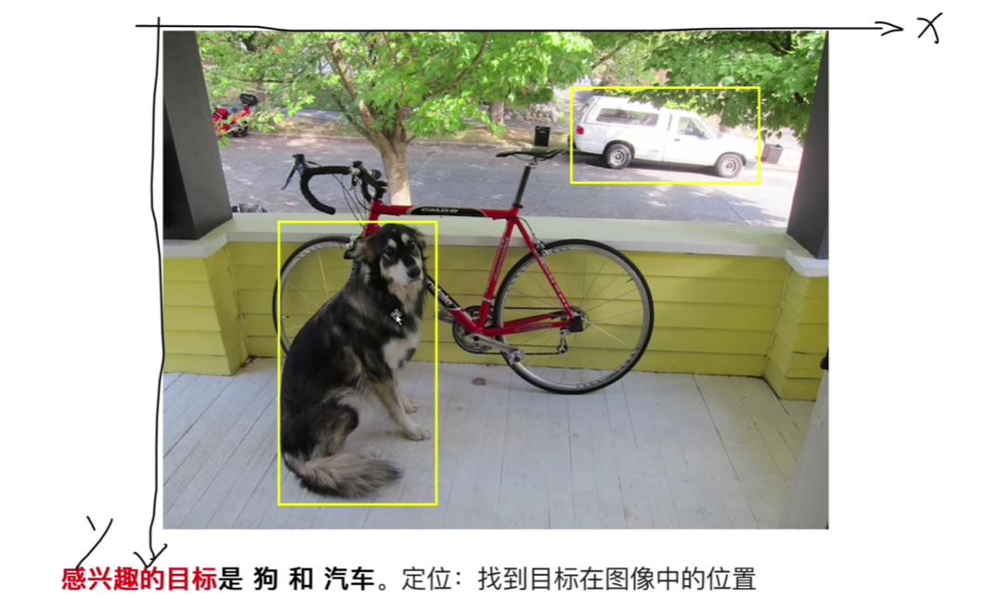
##### 感兴趣的目标

可以是非常规的感兴趣的目标
- 道路裂纹检测
- 文字内容检测
- 可以是麦穗

##### 定位

在图像中找到目标的位置

##### 识别

识别矩阵框的内容


## E04 数据集
输入： 带标注的图片

标注数据集的质量

## E05 VOC数据集
#### 数据集目录结构
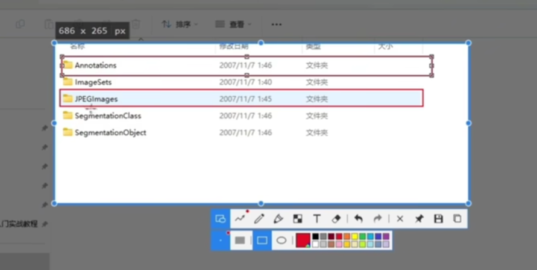
图片文件夹和配置文件一一对应
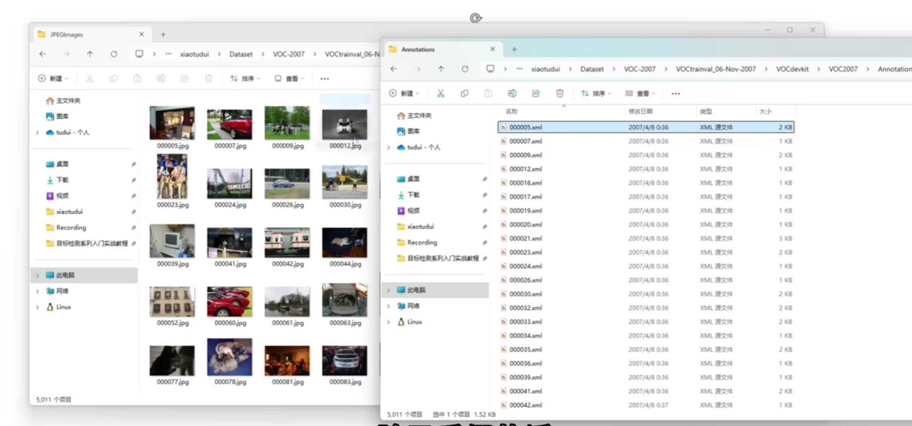
这个数据集支持的其他比赛，这个项目目录其他文件夹的作用
- 类别识别 class
  - 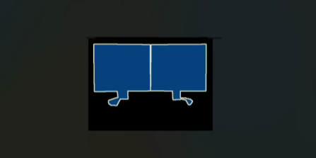
  - 
  - 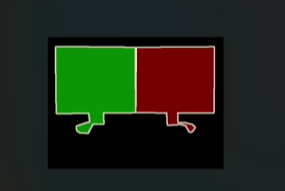
- 对象识别 object
- 身体各个部分识别 layout
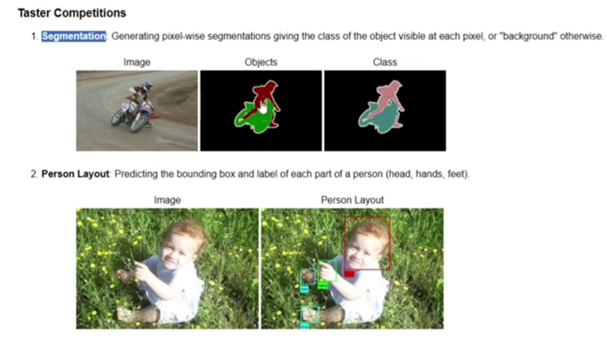
###  标注文件长什么样
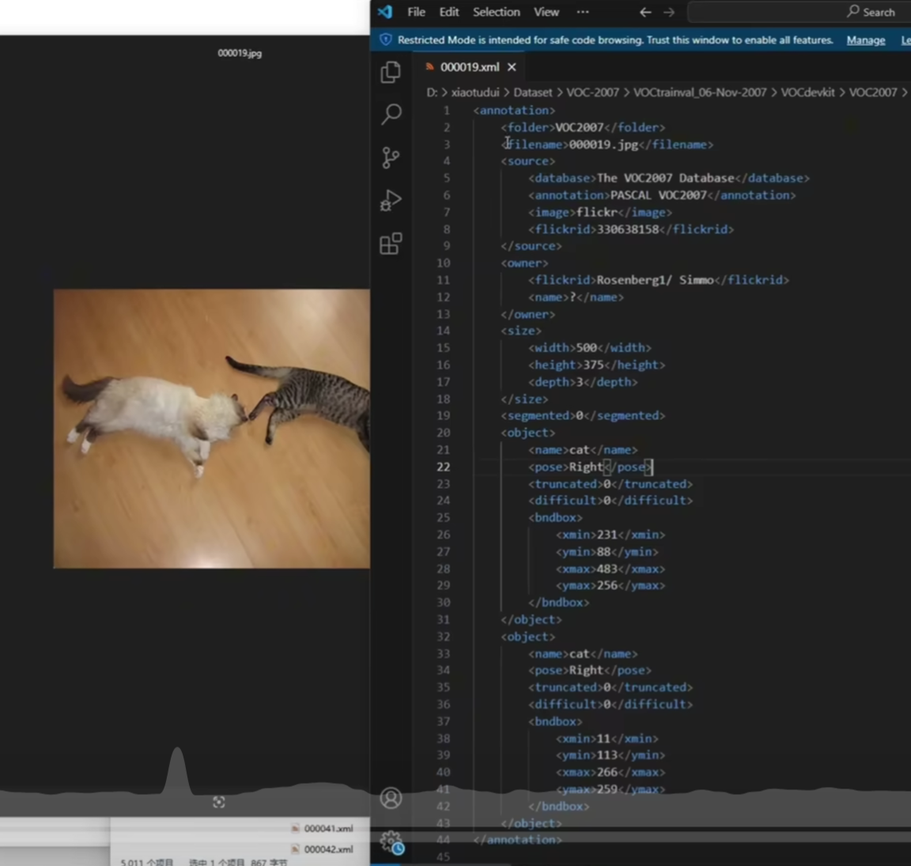
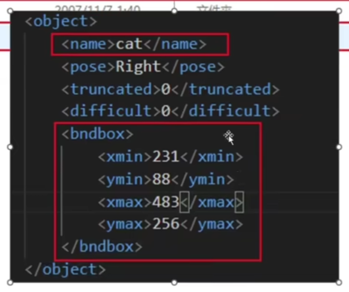
```xml
<object>
    <name> cat </name>
    <!--拍摄机位-->
    <pose>Right</pose>
    <!--是否被截断-->
    <truncated>0</truncated>
    <!--是否难以辨别（是否打了马赛克）-->
    <difficult>
    </difficult>
    <!--框选的位置-->
    <bndbox>
        <xmin>231</xmin>
        <ymin></ymin>
        <xmax>483</xmax>
        <ymax>256</ymax>

    </bndbox>
</object>
```
##### imageJ 
a tool for watching picture
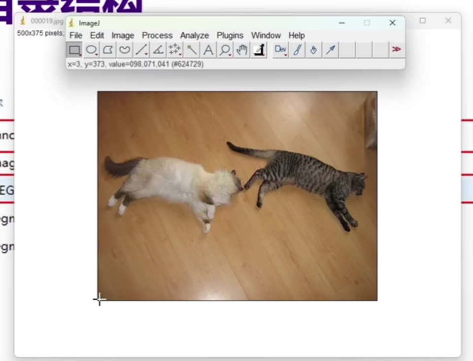
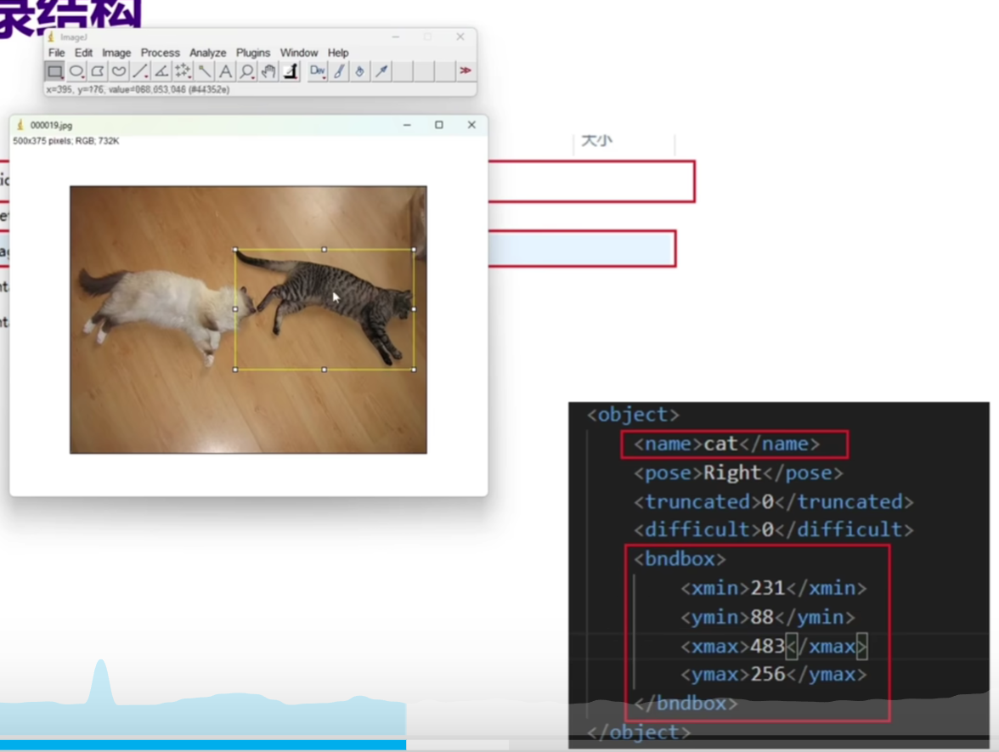
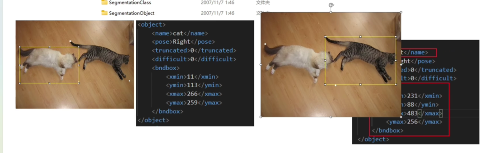
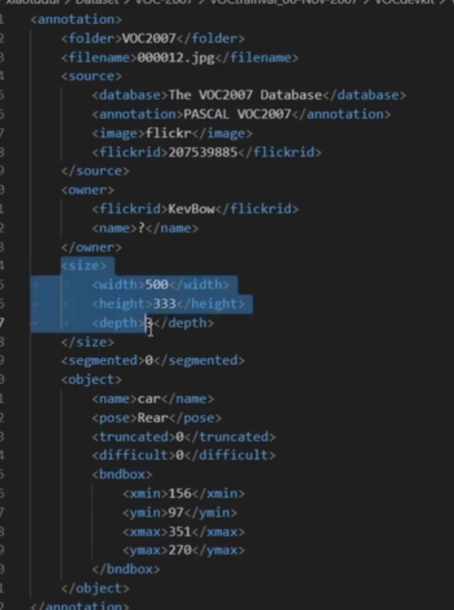
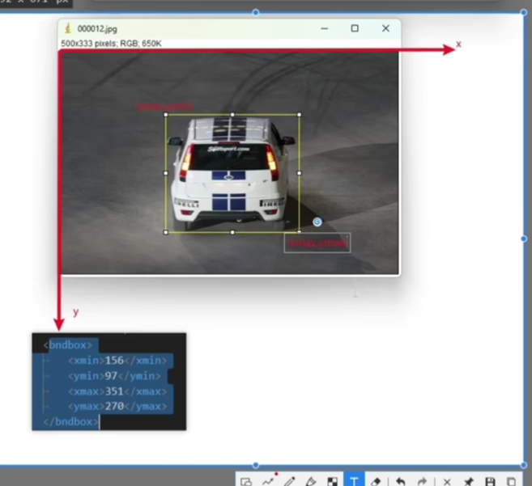
### 关注
- 关心Annotations 文件加 和JPEGImages 文件夹
- Annotations 文件夹存放的是对图片的标注
- JEPG Images文件夹存放的是图片
- 标注文件
  - Object的内容（name， bndbox）
  - bndbox 左上角最小值xmin，ymin
  - bndbox 右下角xmax，ymax
  - 坐标轴左上交最小，右下角最大
  - www.xiaotudui.com
## E06 coco数据集
官网 https://cocodataset.org/   
- 目标检测 detection (用矩阵框选目标)
- 目标分割 segmentation (相对于目标检测更加细致)
- 看图说话 caption 这个图像里面有什么，用语言描述出来，还跟自然语言处理有关
数据集分类
* 训练
* 验证
* 测试
## E07 coco数据集目录结构
这是训练数据集和验证数据集的标注
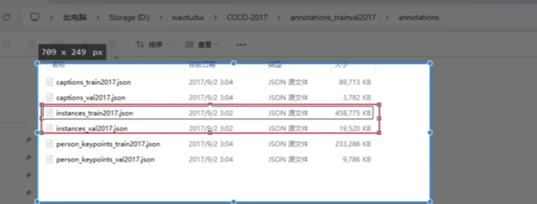
coco标注文件结构
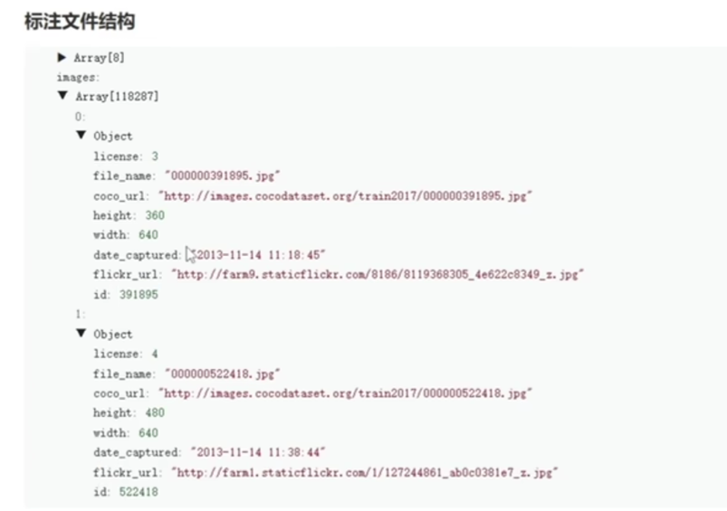
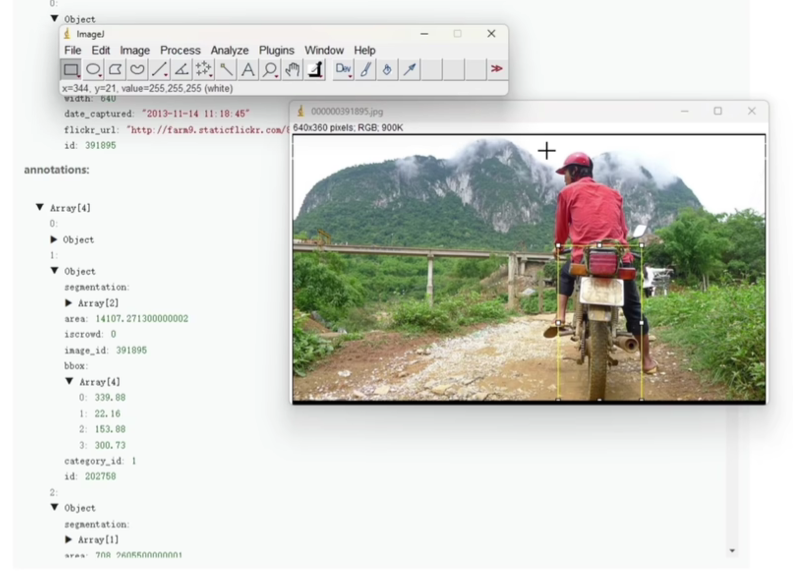](../../assets/imgs/boject_detetction/annotationInfo.png)
coco bndbox 的各个值代表xmin，ymin，width，height

类别id可以从总类别中找到bbox中的目标是什么物体
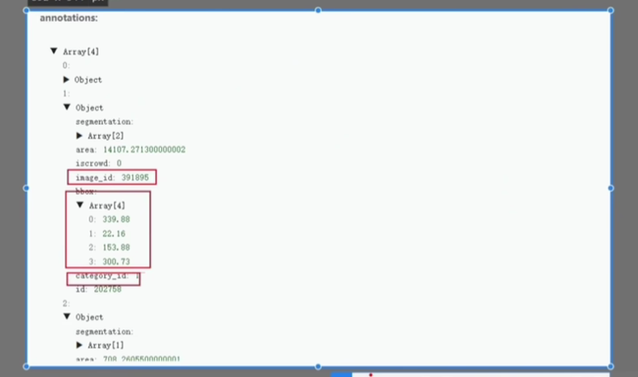
## E08yolo数据集标注格式
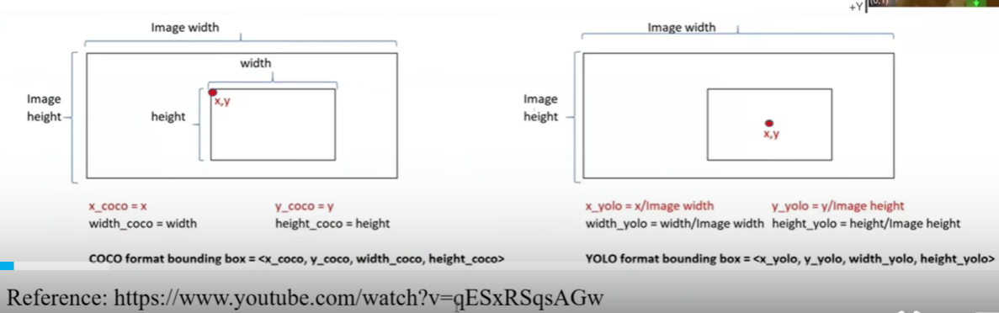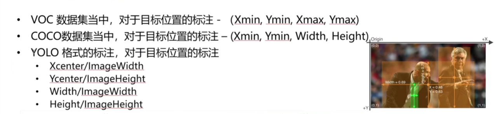
三种数据集的标注格式对比
 
## E09标注自己的数据集
#### 标注工具
- Labellmg(不用配置环境)
- LabelStudio(python的一个库 E10)
  - 可以协同工作(协同工作)
- LabelMe(E12)
## E13 环境配置
